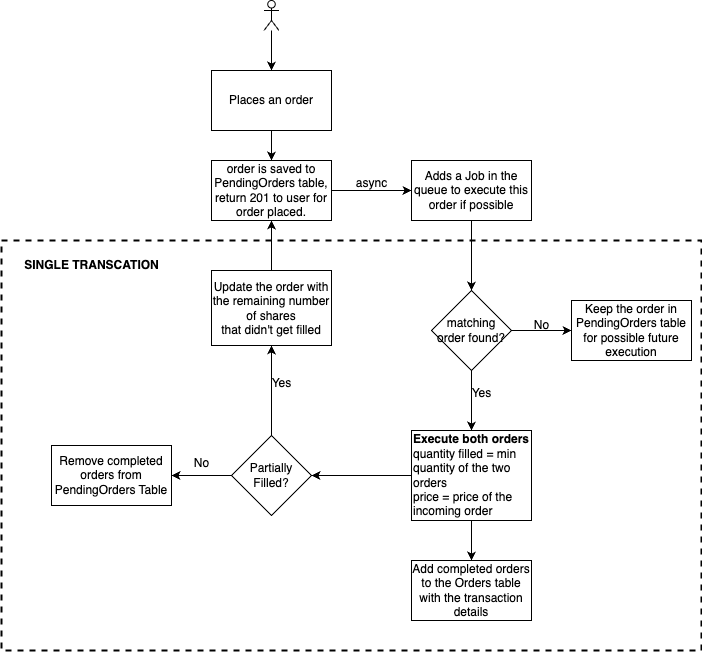

# README

Requirements:
-
* User can place an order to buy/sell a certain quantity of a stock at a certain price
* User can list their pending and completed orders

How to run:
-
* Prereq: redis
  * `brew install redis`
  * `redis-server`

* From the root directory:
  * `bundle install`
  * `rails db:migrate`
  * `./bin/dev`

Workflow and Design:
-
* **Schema**:
  * PendingOrder
      ```
      t.bigint   :user_id,    null: false, index: true
      t.string   :symbol,     null: false, index: true
      t.string   :type,       null: false
      t.decimal  :price,      precision: 11, scale: 4, null: false
      t.bigint   :quantity
      t.datetime :expires_at
      t.timestamps
      ```
  * Order
    ```
    t.bigint   :user_id,         null: false, index: true
    t.string   :symbol,          null: false, index: true
    t.string   :type,            null: false
    t.decimal  :filled_at_price, precision: 11, scale: 4
    t.bigint   :quantity,        null: false
    t.string   :status
    t.datetime :order_place_at
    t.datetime :expired_at
    t.datetime :filled_at

    t.timestamps
    ```
  * _Having separate tables help for a faster lookup to find a matching order for an incoming order since we don't need to look at the orders that are already complete/expired._
  * _Indexed on `user_id` and `symbol` for faster lookup._
  <br/><br/>
* **Order Execution**:
  * 
  <br/><br/><br/>
* **Order Expiration Flow**:
  * A scheduled job is run everyday at 4:01 PM EST (After market closes) to mark all the orders that expired on that day as `expired`.
  <br/><br/> 

Example Requests:
-
1. POST: localhost:3000/orders
  - body:
    ```
    {
        "order": {
            "user_id": 1,
            "symbol": "TSLA",
            "type": "buy",
            "quantity": 50,
            "price": 350,
            "expires_at": "11/13/2024"
        }
    }
    ```
  - response:
    ```
    {
        "id": 26,
        "user_id": 1,
        "symbol": "TSLA",
        "type": "buy",
        "price": "350.0",
        "quantity": 50,
        "expires_at": "2024-11-13T16:00:00.000Z",
        "created_at": "2024-11-12T15:01:32.348Z",
        "updated_at": "2024-11-12T15:01:32.348Z"
    }
    ```
2. POST: localhost:3000/orders
  - body:
    ```
    {
        "order": {
            "user_id": 2,
            "symbol": "TSLA",
            "type": "sell",
            "quantity": 30,
            "price": 345,
            "expires_at": "11/13/2024"
        }
    }
    ```
  - response:
    ```
    {
        "id": 27,
        "user_id": 2,
        "symbol": "TSLA",
        "type": "sell",
        "price": "345.0",
        "quantity": 30,
        "expires_at": "2024-11-13T16:00:00.000Z",
        "created_at": "2024-11-12T15:03:51.345Z",
        "updated_at": "2024-11-12T15:03:51.345Z"
    }
    ```
3. GET: localhost:3000/orders?user_id=1
  - response:
    ```
    {
        "pending_orders": [
            {
                "id": 26,
                "user_id": 1,
                "symbol": "TSLA",
                "type": "buy",
                "price": "350.0",
                "quantity": 20,
                "expires_at": "2024-11-13T16:00:00.000Z",
                "created_at": "2024-11-12T15:01:32.348Z",
                "updated_at": "2024-11-12T15:03:51.362Z"
            }
        ],
        "completed_orders": [
            {
                "id": 20,
                "user_id": 1,
                "symbol": "TSLA",
                "type": "buy",
                "filled_at_price": "350.0",
                "quantity": 30,
                "status": "filled",
                "order_place_at": "2024-11-12T15:01:32.348Z",
                "expired_at": null,
                "filled_at": "2024-11-12T15:03:51.361Z",
                "created_at": "2024-11-12T15:03:51.361Z",
                "updated_at": "2024-11-12T15:03:51.361Z"
            }
        ]
    }
    ```
3. GET: localhost:3000/orders?user_id=2
  - response:
    ```
    {
        "pending_orders": [],
        "completed_orders": [
            {
                "id": 19,
                "user_id": 2,
                "symbol": "TSLA",
                "type": "sell",
                "filled_at_price": "350.0",
                "quantity": 30,
                "status": "filled",
                "order_place_at": "2024-11-12T15:03:51.345Z",
                "expired_at": null,
                "filled_at": "2024-11-12T15:03:51.354Z",
                "created_at": "2024-11-12T15:03:51.359Z",
                "updated_at": "2024-11-12T15:03:51.359Z"
            }
        ]
    }
    ```


Some Key files:
-
* **models**: [order.rb](./app/models/order.rb) and [pending_order.rb](./app/models/pending_order.rb)
  - handles basic validation before saving the record
  - `pending_order` on `after_create` callback, enqueues a job `ExecuteOrdersJob` to try and execute the order if possible.
* **controller**: [orders_controller.rb](./app/controllers/orders_controller.rb)
* **schema**: [schema.rb](./db/schema.rb)
* **ActiveJobs**:
  - [ExecuteOrdersJob](./app/jobs/execute_orders_job.rb):
    - looks up for the matching pending order
    - executes the orders if matching
    - handles partial fulfillment
    - executed orders are moved to Order table for bookkeeping
    - partially filled order is updated in PendingOrder table with remaining quantity
    - **ALL THE QUERIES IN THIS JOB ARE PERFORMED AS A SINGLE TRANSACTION TO ENSURE CONSISTENT STATE OF SYSTEM AT ALL TIMES**
  - [CancelExpiredPendingOrdersJob](./app/jobs/cancel_expired_pending_jobs_job.rb):
    - Scheduled to run everyday at 4:01 PM EST (After market closes), to move all the `PendingOrders` that expired on that day to `Orders` table with `expired` state.
    - - **ALL THE QUERIES IN THIS JOB ARE PERFORMED AS A SINGLE TRANSACTION TO ENSURE CONSISTENT STATE OF SYSTEM AT ALL TIMES**